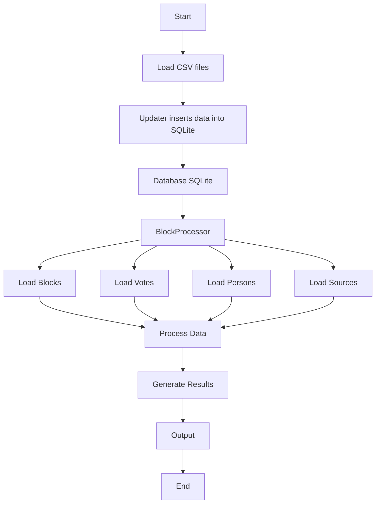

# BlockProcessor (Labs 2–6)

## Project Description

This project implements a **BlockProcessor** system for handling structured data such as blocks, votes, persons, and sources.

Throughout Labs 2–6, the project evolves from simple CSV-based data handling to a full **SQLite-backed system**.

The project demonstrates:
- Working with SQLite databases
- Clean Python structure using classes and dataclasses
- CRUD operations
- Data processing and relationships between entities

---

## Project Structure

```
project/
│
├── main.py              # Entry point of the application (need to be optimised)
│
├── processor/
│   └── BlockProcessor.py  # Core processing logic
│   └── core.py            # Base of Classes
│
├── updater/
│   └── updater.py       # CLI tool for inserting data into DB
│
├── data/
│   ├── data.csv                # .csv file generated by script
│   ├── generate_test_data.py   # Script to generate test data
│   ├── blocks.csv
│   ├── votes.csv
│   ├── persons.csv
│   └── sources.csv
├── test_core.py     # Test of Classes logic (validation etc.)
│
└── tutorial.db              # SQLite database
```

---

## Features

- Import data from CSV files
- Store data in SQLite database
- Query and retrieve structured data
- Maintain relationships between entities
- Process data using BlockProcessor logic

---

## Core Entities

- **Block** — main data unit
- **Vote** — voting records
- **Person** — users
- **Source** — data sources
- **Chain** — result of chaining process on blocks
---

## System Flow



---

## How to Run

### 1. Populate the database

```bash
python updater/updater.py
```

### 2. Run the main application

```bash
python main.py
```

---

## Technologies Used

- Python
- SQLite
- Dataclasses
- Mermaid (for diagrams)

---

## Notes

- The database is stored locally in `turotial.db`
- The system is easily extendable (e.g., API or UI can be added)

---

## Author

Yakushenkov Oleksandr